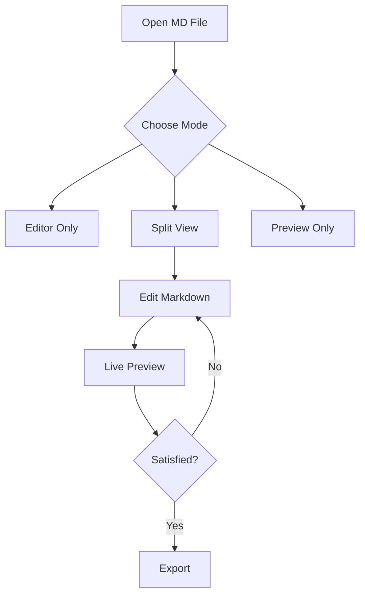
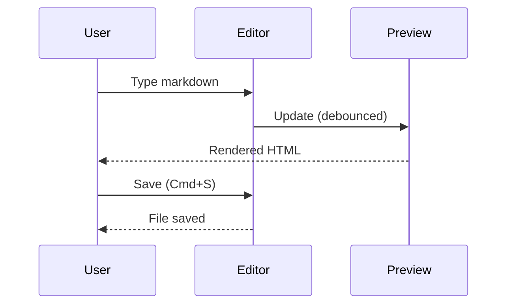

# MarkLink SL — Sample Document

This document demonstrates all supported Markdown features.

## Text Formatting

**Bold text**, *italic text*, ~~strikethrough~~, and `inline code`.

You can also combine them: ***bold and italic***, **`bold code`**.

## Links & Images

[Visit SeouLink](https://seoulink.com)


## Lists

### Unordered List
- Item 1
  - Nested item
  - Another nested item
- Item 2
- Item 3

### Ordered List
1. First step
2. Second step
3. Third step

### Checklist
- [x] Create project structure
- [x] Implement editor
- [x] Implement preview
- [ ] Deploy to GitHub Pages
- [ ] Add more features

## Code Blocks

### JavaScript
```javascript
async function fetchData(url) {
  const response = await fetch(url);
  const data = await response.json();
  return data;
}
```

### Python
```python
def fibonacci(n):
    if n <= 1:
        return n
    return fibonacci(n - 1) + fibonacci(n - 2)
```

### CSS
```css
.markdown-body {
  font-family: -apple-system, sans-serif;
  line-height: 1.7;
  color: var(--text-primary);
}
```

## Blockquote

> The best way to predict the future is to create it.

> **Nested blockquote:**
> > This is a nested blockquote.

## Table

| Feature | Description | Status |
|---------|-------------|--------|
| Split View | Editor + Preview side by side | ✅ |
| Syntax Highlight | Code blocks with colors | ✅ |
| Dark Mode | System detect + manual toggle | ✅ |
| Math (KaTeX) | LaTeX math equations | ✅ |
| Mermaid | Diagrams and flowcharts | ✅ |
| File Management | Open, save, drag & drop | ✅ |
| Export | Print, PDF, HTML | ✅ |

## Math (KaTeX)

Inline math: $E = mc^2$

Block math:

$$
\int_{-\infty}^{\infty} e^{-x^2} dx = \sqrt{\pi}
$$

$$
\sum_{n=1}^{\infty} \frac{1}{n^2} = \frac{\pi^2}{6}
$$

## Mermaid Diagrams

### Flowchart


### Sequence Diagram


## Horizontal Rule

---

## Conclusion

MarkLink SL is your go-to Markdown viewer and editor.
Built with ❤️ by **SeouLink (SL Corporation)**.
